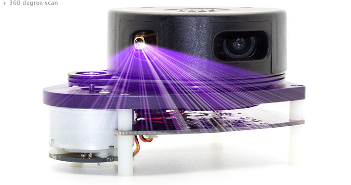
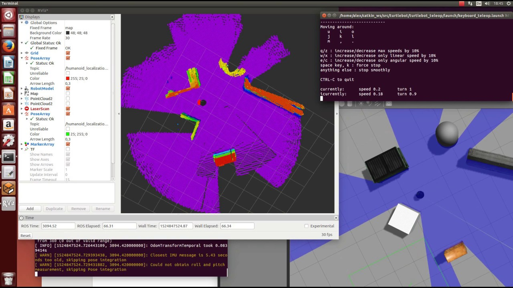
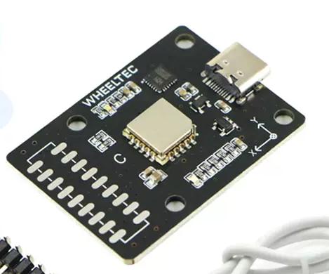
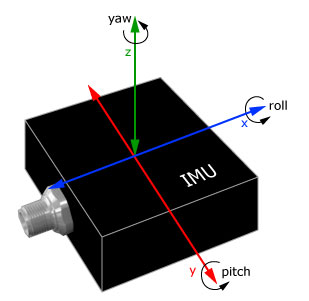
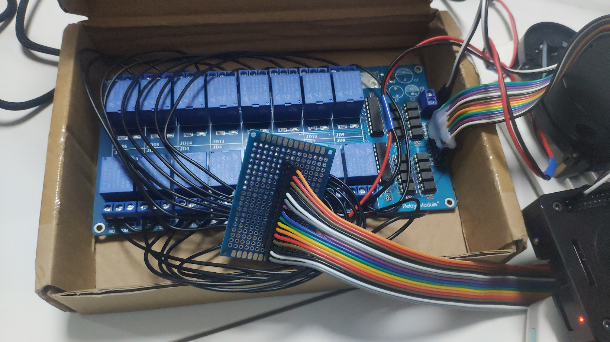
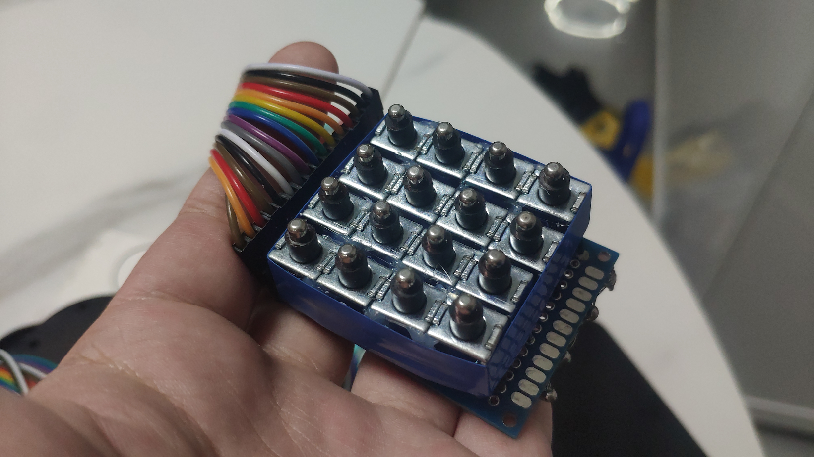
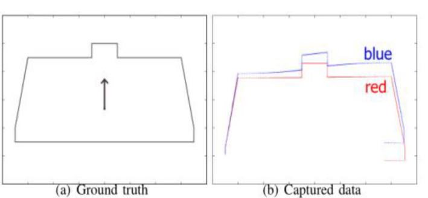
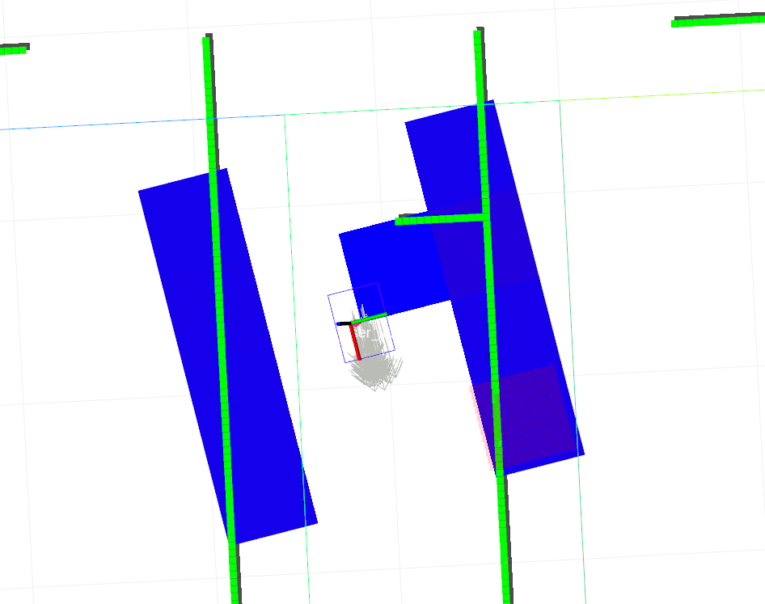

# 触觉地图

你能通过触摸感受周围的环境

## 期望的行为

周围的墙壁等障碍物, 将显示在触摸反馈装置上, 可以通过触摸感受到

## 组成部分

### 传感器

1. 激光雷达

   通过向周围发射激光, 探测障碍物的距离, 从而确定障碍物的位置

   <block>
   
   
   </block>

1. 惯性测量单元 (IMU)

   通过测量加速度, 角速度, 磁场强度等参数, 为用户的位置和姿态提供参考

   <block>
   
   
   </block>

由于条件限制, 本概念验证设备只能使用一个便宜的单线三角测距 2D 激光雷达. 实际应用时应该使用一个大范围, 高频率的 3D 激光雷达.
本概念验证设备只能使用一个平均水平的惯性测量单元, 因为只用于检测重力方向(3D 点云重建时需要), 以及提供 ahrs 辅助激光 SLAM 定位, 这个单元应该就能满足应用要求

### 单板计算机

1. 树莓派 4B

   接受激光雷达与惯性测量单元的数据, 进行处理, 建立周围环境的地图, 并将控制信号发送给触摸反馈装置

   

### 触摸反馈装置

1. 驱动电路

   接受来自树梅派的控制信号, 将其进行解码, 电流放大, 从而驱动触摸反馈装置的电磁铁

   

1. 触摸终端

   一个矩阵的电磁铁, 通过驱动电路的控制, 使金属柱体突出或缩进. 用户可以通过触摸感受到金属柱体的位置

   

   本概念验证只搭建了一个 4\*4 的针矩阵, 由 16 个电磁铁粘在一起构成. 实际应用中应该使用更大分辨率与像素密度的针矩阵

## 工作原理

### 传感器信号预处理

1. 通过来自 IMU 的速度信息, 去除激光雷达的运动畸变

1. 通过来自 IMU 的重力加速度矢量, 去除激光雷达的倾斜导致的畸变

图中, 蓝色的为激光雷达的原始数据, 红色为矫正后的数据

### 实时定位与建图

使用了 Google 的 Cartographer 算法, 通过激光雷达与 IMU 的数据, 构建地图

### 触摸信号的生成

通过 Cartographer 提供的定位, 在用户周围的地图中搜索一个区域, 将其降采样. 降采样后的每个像素分别对应一个触摸反馈设备上的金属柱体

SLAM 得到的高分辨率地图, 要以 base_link 系为基准, 得到一个低分辨率的格栅地图, 对应针矩阵的分辨率. 概念验证设备的分辨率是 4x4, 所以降采样的地图分辨率是 4x4.
针矩阵上一个点对应真实世界中 0.5m, 即要搜索地图中一个 2m\*2m 的范围来制作降采样的地图. 在本次验证, 范围在 x 方向有 2m 的偏置, 即只显示前方的内容

降采样后的地图是一个二维矩阵, 每个值代表该像素被障碍物占领的概率.
得到降采样后的地图, 判断每个像素的占位是否超过致命代价值, 如果是, 就通过 GPIO 操作针矩阵上的该像素缩进, 如果不是就控制其突出.

### 触摸终端的控制

通过树莓派的 GPIO 口, 传输一个 4 位的二进制电平信号, 分别对应触摸终端的 16 个电磁铁.

通过一个 CD74HC4067 芯片, 将 4 位的二进制信号解码成 16 个输出, 分别对应每个电磁铁

16 个信号会经过一个光耦隔离 (避免意外烧毁树莓派), 通过一个达灵顿晶体管放大电流, 控制一系列继电器, 从而控制电磁铁

## 目前的缺陷

1. 激光雷达为 2D, 无法探测雷达平面之外的障碍物. 例如, 无法探测到放在地上的低矮物体

1. 激光雷达的线数少, 频率低, 如果用户运动较快, 会导致地图的更新不及时, 甚至定位丢失

1. 触摸终端的分辨率只有 4\*4, 只能进行基本的定位, 无法进行精细的感知

1. 触摸终端缺乏交互, 不能直接通过终端控制地图的缩放, 偏移等操作

1. 元件的选择不够合理, 电磁铁功率过高, 电路的设计不够优化, 电路的体积大, 不方便携带. 功耗较高, 电池的使用时间较短, 发热严重, 潜在的可能烫伤用户

## 未来的改进

1. 通过 3D 激光雷达的点云信号, 探测雷达平面之外的障碍物

1. 使用更高分辨率的触摸终端, 从而提高触摸反馈的精度, 同时加入交互控制功能

1. 提高集成度, 使得设备便于携带与使用
